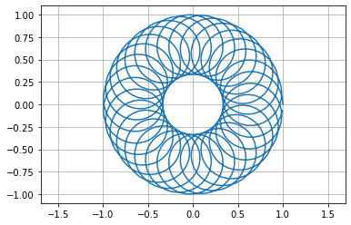

A FUSE FS that does on-the-fly sample type conversion.

Currently this is only a proof-of-concept that operates on a single file with
i16 values and converts to f32.

The f32 file view can be `memmap`ed (e.g. in NumPy) without needing to convert the
entire file. This is useful for random-access analysis of very large SDR capture
files. I have tested with 100GB files with no issues.

This will work with scalar or complex values.

# Example

```bash
# Make a mount point
mkdir testmnt

# Mount the DSP FS
cargo run -- test.cs16 testmnt &

# Check it out
ls -alh testmnt
hexdump testmnt/test.cs16

# Unmount when done
fusermount -u testmnt
```

If you do this in NumPy:

```python
a = np.memmap("testmnt/test.cs16",dtype=np.complex64, mode="r")
plt.plot(np.real(a),np.imag(a))
```

You should see this:



# Notes

Building fuser will require something like:

```
sudo apt-get install libfuse-dev pkg-config
```

See: https://github.com/cberner/fuser

# Ideas / TODO

- Support more conversion types
- Rename converted files? (test.cs16 to be seen as test.cf32 or test.cs16.cf32)
- Q: To scale or not to scale? (optional?)
- Allow writing? (opposite direction conversion)
- Any need for output formats other than f32? (e.g. f64)

## Multiple file support

There are a few different ways to do this:

- Specify multiple files on the command line
- Use a configuration file
- Use an entire directory as a source

Things get a little tricky when files have different formats. How do we specify
the format for each file? Using recognizable file extensions seems like the
easiest choice.

## Other DSP operations

In general, I think it is preferable to do most signal processing in the client
application. Numpy or whatever.

But there are some cases that might make sense in the FUSE layer.

### Channelization

While the normal operation allows for easy random access to different offsets
(times), some capture files may be very wide bandwidth, and only a subsection
of the frequency spectrum is desired.

Down-sampling without frequency translation would be a special case of the same
general technique.

Filtering would be required for this operation, so there is no reason not to
support general filtering without resampling or frequency translation.

Parameter specification with multiple file support could get complex and would
likely require the use of a configuration file.
